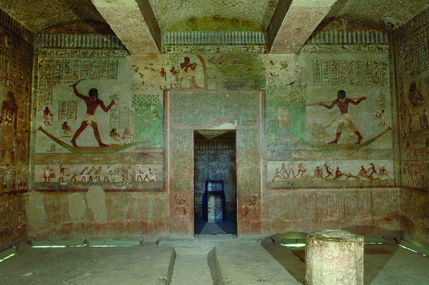

# Welcome to Beni Hassan @ Macquarie

A resource for the Macquarie University Beni Hassan Project: Measuring Meaning in Egyptian Art - A New Approach to an Intractable Problem, supported by the Australian Research Council Discovery Project Scheme. 

This website aims to provide general resources, a selection of photographs, updates on fieldwork and a list of publications relating to the Macquarie University expedition working and researching the upper cemetery at Beni Hassan (2009-present). 

The Macquarie University Beni Hassan Project is supported by an Australian Research Council Discovery Project grant from 2016--2018, and is a collaboration between Macquarie University and the Metropolitan Museum of Art, New York.

	
		
	
	
		
	

